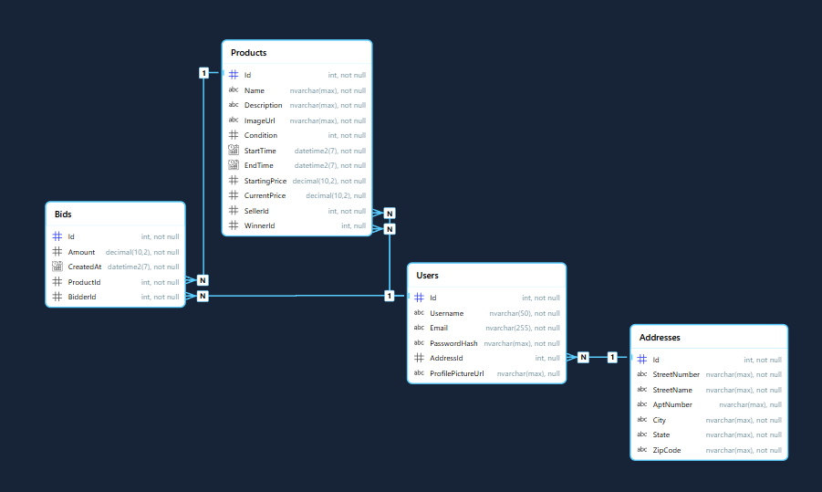

# Team-BB---Budget-Bay

## Synopsis

Budget Bay is an e-commerce web application designed for online auctions, enabling users to buy and sell items through bidding. Clients can easily create an account, log in securely, and explore available listings. They have the ability to post their own items for auction, place bids on other items, and track bidding activity in real time. Users can also manage their accounts, review their bidding history, and update personal details. Additionally, the platform features a powerful search function, allowing users to quickly find items by name or category, ensuring a smooth and intuitive shopping experience.

## Features

* As a user, I want to browse and filter auctions by category, price, and status(active/closed).
* As a seller, I want to create an auction listing by title, description, starting price, end date, and category, so that I can sell my items to the highest bidder.
* As a user, I want to sign up so I can have an account.
* As a buyer, I should be able to place a bid on a product
* As a user, I want to be able to login to view products and place bids

## Entity Relationship Diagram (ERD)

## Wireframe Diagram

